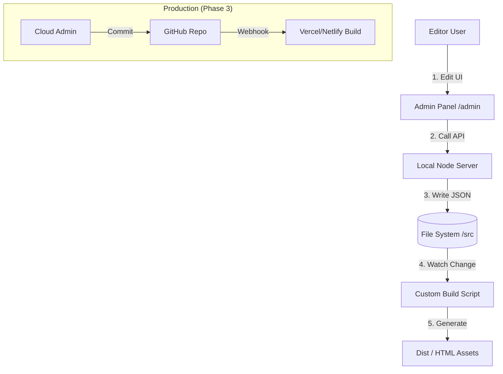

# Roadmap: Transition to Custom Static CMS System

Tài liệu này vạch ra lộ trình chuyển đổi hệ thống ZTools từ Custom SSG thuần túy sang mô hình **Git-based / Hybrid CMS**, cho phép quản lý nội dung mà không cần thao tác code thủ công.

## Mục tiêu (Objectives)
- **Quản trị dễ dàng**: Thêm/sửa/xóa tool, category, và bản dịch thông qua giao diện Admin UI.
- **Giữ nguyên hiệu năng SSG**: Vẫn đảm bảo output cuối cùng là file tĩnh (HTML/CSS/JS) để tối ưu SEO và tốc độ (Zero-runtime overhead).
- **Scalability**: Sẵn sàng cho việc mở rộng số lượng tool lớn và nhiều người đóng góp (collaborators).

---

## Phase 1: Architecture Restructuring (Atomic / Feature-based) - **PRIORITY: ASAP**
*Mục tiêu: Chuyển đổi cấu trúc folder dự án sang dạng Atomic/Modular. Mỗi tính năng (tool) sẽ tự quản lý toàn bộ tài nguyên của mình (View, Logic, Style, Content).*

### 1.1 New Folder Structure
- [x] Tạo folder `src/features/` để chứa các công cụ biệt lập.
- [x] Di chuyển code theo cấu trúc:
    ```
    src/features/tax-calculator/
      ├── index.ejs (View)
      ├── script.js (Logic)
      ├── style.css (Styling)
      └── content.yaml (Data/Locales/Metadata)
    ```

### 1.2 Update Build System (`build.js`)
- [x] Viết lại logic `buildPages()`: Quét cả `src/pages` (static) và `src/features` (tools).
- [x] Viết lại logic `buildAssets()`:
    - Tự động bundle/minify JS/CSS nằm trong folder feature.
    - Output ra `dist/assets/features/[feature-name]/style.css`.
- [x] Viết lại logic `Load Data`: Đọc `content.yaml` trong từng feature folder để lấy config (thay vì dồn chung vào `tools.yaml` lớn).

### 1.3 Migration & Cleanup
- [x] Di chuyển lần lượt từng tool hiện có vào cấu trúc mới.
- [x] Xóa bỏ các file rời rạc trong `src/assets/js`, `src/assets/css`, `src/pages`.
- [x] Đảm bảo `npm run dev` và `npm run build` vẫn hoạt động mượt mà.

---

## Phase 2: Local Admin Interface (MVP)
*Mục tiêu: Cho phép sửa nội dung JSON/Config ngay trên trình duyệt khi chạy local (`npm run dev`), thay vì sửa file code.*

### 2.1 Backend API Layer (Local Only)
- [x] Tạo một **Admin Server** nhẹ (Express + `server.js`).
- [x] Viết API endpoint:
    - `GET /api/features`: Đọc list tool từ folders.
    - `POST /api/features/:id`: Update `tool.yaml` & trigger rebuild.
- [x] (Bonus) Global Config API: Đã tách `global.yaml` để quản lý settings chung.

### 2.2 Admin Frontend
- [x] Dựng trang `/admin` (Client-side render simple HTML/Vue/React).
- [x] UI Features:
    - **Dashboard**: Thống kê số lượng tools.
    - **Tool Editor**: Form sửa `tool.yaml` trực quan.
    - **Global Settings**: Form sửa `global.yaml`.

### 2.3 Auto-rebuild Integration
- [x] Tích hợp với `build.js`: Khi API ghi file xong -> Tự động trigger hàm `build()` -> Live Reload trình duyệt.

---

## Phase 2: Content Modeling & Schema Standardization
*Mục tiêu: Chuẩn hóa dữ liệu để máy có thể hiểu và tự động sinh code/template.*

### 2.1 Decouple Logic & Data
- [x] Chuyển `src/data/tools.js` từ file JS sang **YAML** thuần. (Đã chuyển sang model `features/*/tool.yaml`).
- [x] Định nghĩa **Schema** cho một "Tool":
    ```yaml
    id: "password-generator"
    type: "generator"
    inputs: 
      - id: length
        type: range
      - ...
    actions: ...
    ```
    *(Đã áp dụng mẫu cho Password Generator)*

### 2.2 Template Engine Upgrade
- [x] Nâng cấp `build.js` để đọc Schema -> Tự động chọn Template EJS tương ứng.
    - Đã tạo `src/templates/generator.ejs` generic.
    - `build.js` đã inject `toolConfig` vào view.
- [ ] Giảm thiểu việc code cứng HTML cho từng tool mới. (Đang thực hiện migrate các tool còn lại).

---

## Phase 3: Cloud-Ready & Authentication (Production CMS)
*Mục tiêu: Đưa trang Admin lên môi trường production an toàn.*

### 3.1 Authentication & Role
- [ ] Tích hợp Auth Provider (Clerk, Auth0, hoặc Firebase Auth).
- [ ] Phân quyền: Editor (sửa nội dung), Admin (publish/deploy).

### 3.2 Git-based Workflow (GitOps)
- [ ] Thay vì ghi file trực tiếp trên server production (không khả thi với Vercel/Netlify), Admin API sẽ commit thay đổi vào **GitHub Repo**.
- [ ] Sử dụng GitHub API để tạo Commit: "Update tool data via CMS".
- [ ] Webhook từ GitHub sẽ trigger CI/CD pipeline để rebuild và deploy site mới.

---

## Phase 4: Advanced Features (Optional)
- [ ] **ISR (Incremental Static Regeneration)**: Nghiên cứu Next.js hoặc custom build script để chỉ build lại các trang bị thay đổi.
- [ ] **Plugin System**: Cho phép upload file JS logic của tool thông qua Admin (như WordPress plugin).
- [ ] **Analytics Dashboard**: Tích hợp view report từ GA4/Vercel Analytics ngay trong Admin.

---

## Phase 5: tạo cli để tạo template cho tool mới (Advanced)
- [ ] Tạo cli để tạo template cho page mới
- [ ] Tạo cli để tạo template cho feature mới
- [ ] Tạo cli để tạo template cho category mới
- [ ] Tạo cli để tạo template cho language mới

## Kiến trúc đề xuất (High-Level Architecture)


